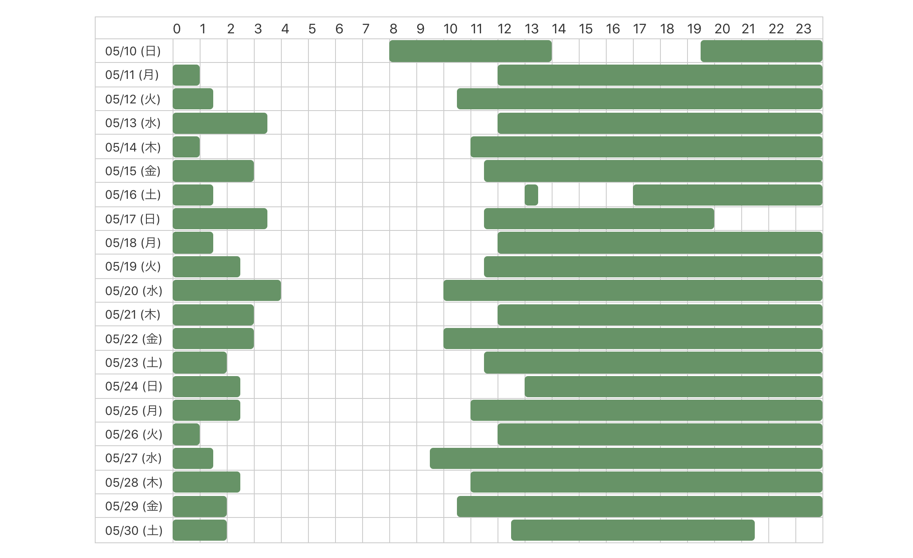
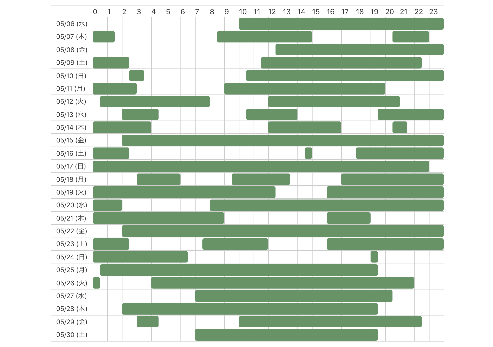

# p1ass/midare

🕒 ツイートを使って生活習慣の乱れを可視化する Web アプリ  
https://midare.p1ass.com

## スクリーンショット

**あまり乱れてない人**

**乱れている人**

## ニュース記事

- [ツイート時刻から「生活習慣の乱れ」を可視化してくれるアプリが登場　「ツイ廃判定アプリ」「なんて恐ろしいものを」 - ねとらぼ](https://nlab.itmedia.co.jp/nl/articles/2006/03/news042.html)
- [ツイ廃ぶりが一目瞭然！ 過去のツイートを分析して「生活の乱れを可視化」するアプリ【やじうま Watch】 - INTERNET Watch](https://internet.watch.impress.co.jp/docs/yajiuma/1257035.html)

## 登壇資料

[うじまる君の生活習慣の乱れを可視化したい！ / uzimaru birthday LT - Speaker Deck](https://speakerdeck.com/p1ass/uzimaru-birthday-lt)

## ブログ

[Twitter トレンド１位になった個人開発 Web サービスの負荷対応記録 - ぷらすのブログ](https://blog.p1ass.com/posts/midare/)
